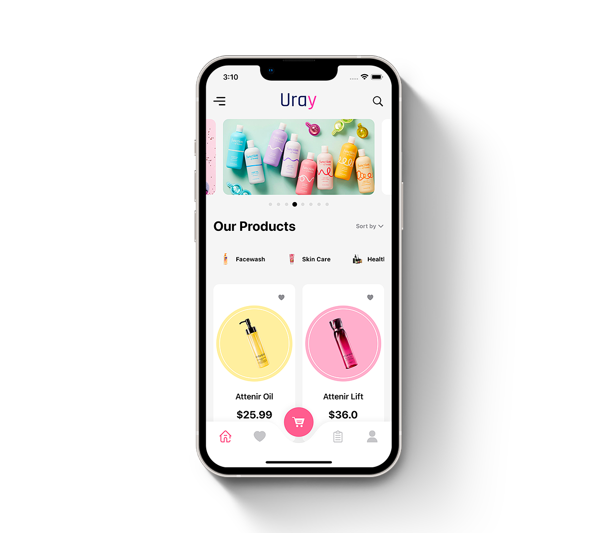
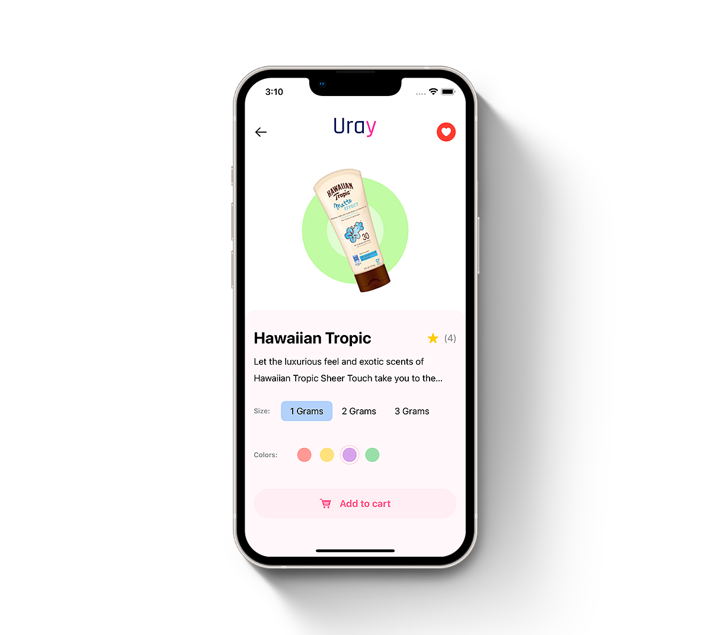

# Uray - eCommerce App UI

Stylish eCommerce iOS App UI with Hero Animations using SwiftUI 3.0.


[](https://opensource.org/licenses/Apache-2.0)
[](https://github.com/shameemreza/uray/blob/main/LICENSE)


## Video Preview

[](https://youtu.be/KZ2Fa-5TnZY "eCommerce App UI")

## Screenshots





## Features

* Hero Animations 
* SwiftUI Complex UI
* SwiftUI Matched Geometry Effect
* SwiftUI Custom Tab Bar 
* SwiftUI Curved Tab Bar
* SwiftUI LazyGrids
* SwiftUI Animations
* Snap Carousel Slider
* SwiftUI Drag Gesture
* SwiftUI Geometry Reader
* SwiftUI Custom Paging Control
* SwiftUI Custom Segmented Control

Resources:

* [Snap Carousel Slider by Balaji Venkatesh](https://www.youtube.com/watch?v=4Gw5lDXJ04g)
* [Hero Animations by Balaji Venkatesh](https://www.youtube.com/watch?v=HYYA0wGaWLo)


## License

```
Copyright 2022 Shameem Reza

Licensed under the Apache License, Version 2.0 (the "License");
you may not use this file except in compliance with the License.
You may obtain a copy of the License at

   http://www.apache.org/licenses/LICENSE-2.0

Unless required by applicable law or agreed to in writing, software
distributed under the License is distributed on an "AS IS" BASIS,
WITHOUT WARRANTIES OR CONDITIONS OF ANY KIND, either express or implied.
See the License for the specific language governing permissions and
limitations under the License.
```
